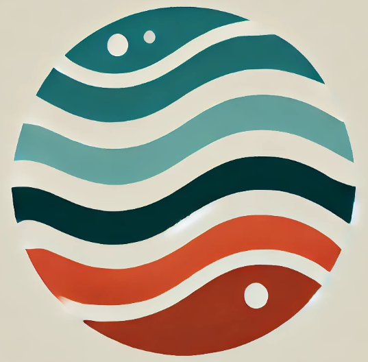
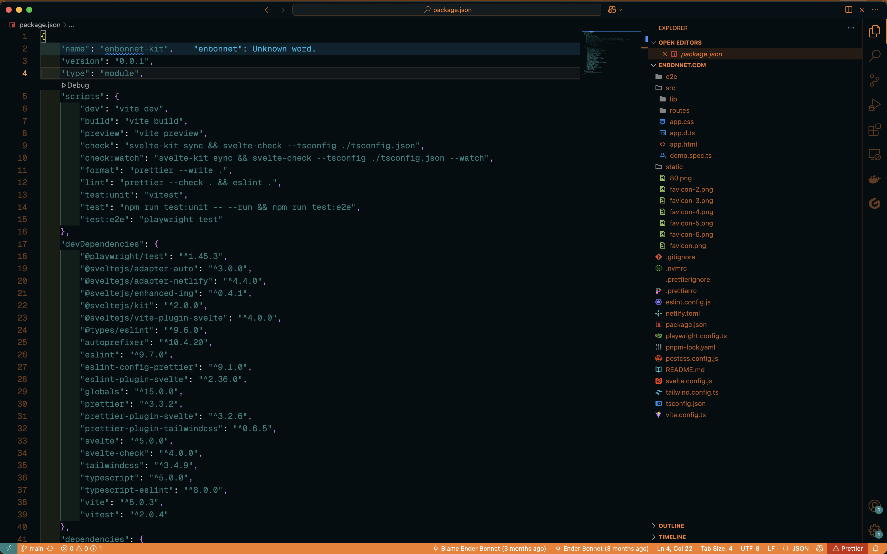
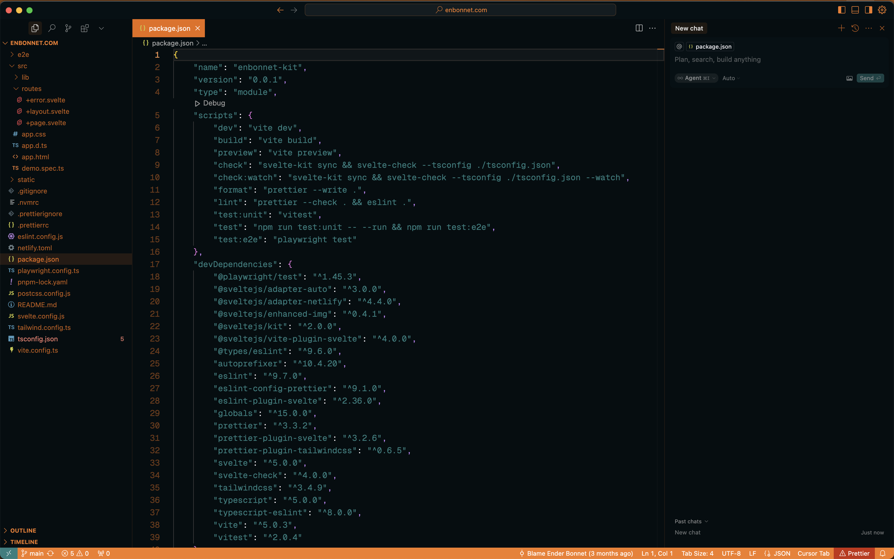
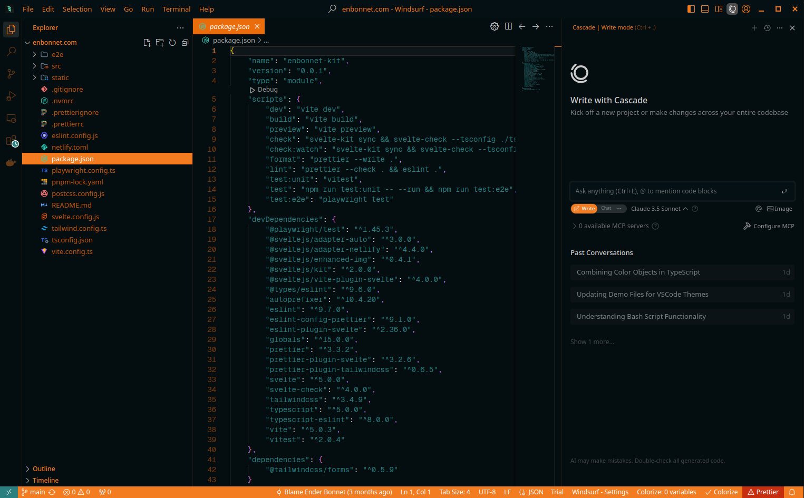

<div align="center">

# Orange Ocean Theme

[](https://marketplace.visualstudio.com/items?itemName=enbonnet.orange-ocean)
[](https://marketplace.visualstudio.com/items?itemName=enbonnet.orange-ocean)
[](./LICENSE)



</div>

## Table of Contents

- [Features](#features)
- [Preview](#preview)
- [Color Palette](#color-palette)
- [ANSI Terminal Colors](#ansi-terminal-colors)
- [Supported Languages](#supported-languages)
- [Installation](#installation)
- [Using the Theme](#using-the-theme)
- [Recommended Settings](#recommended-settings)
- [Development](#development)
- [Contributing](#contributing)
- [Credits](#credits)
- [License](#license)

## Features

- **Warm & Deep** — A dark oceanic background (`#051014`) with glowing orange accents (`#f47c20`) creates a unique environment that reduces eye strain during extended sessions
- **Semantic Highlighting** — Every token type has a carefully chosen color: classes in orange, functions in teal, strings in cyan, keywords in purple. Explicit scoping for 18 languages
- **Multi-Editor Support** — Compatible with VS Code, Cursor, and Windsurf out of the box
- **Balanced Contrast** — Carefully tuned for readability across all panel types without visual fatigue
- **Terminal Colors** — Full ANSI 16-color palette for integrated terminal consistency

## Preview

<div align="center">
  
</div>

| VS Code | Cursor | Windsurf |
|---------|--------|----------|
|  |  |  |

## Color Palette

| Role | Color | Hex | Preview |
|------|-------|-----|---------|
| Background | Deep Ocean | `#051014` |  |
| Editor Background | Dark Ocean | `#040d10` |  |
| Foreground | Bright Mist | `#f8f4f9` |  |
| Text | Soft White | `#cccccc` |  |
| Accent (Orange) | Ember | `#f47c20` |  |
| Accent Dim | Burnt Ember | `#ea6c0b` |  |
| Accent Glow | Faded Fire | `#f79850` |  |
| Teal (Cyan) | Ocean | `#2a7f7f` |  |
| Teal Bright | Reef | `#38a8a8` |  |
| Green | Kelp | `#49fe31` |  |
| Purple | Twilight | `#c986ff` |  |
| Pink | Coral | `#9c4458` |  |
| Red | Warning Red | `#e93e3e` |  |
| Warm Red | Terracotta | `#c94324` |  |
| Yellow | Amber | `#fcae32` |  |

## ANSI Terminal Colors

| ANSI | Name | Normal | Bright |
|------|------|--------|--------|
| Black | | `#000000` | `#666666` |
| Red | | `#cd3131` | `#f14c4c` |
| Green | | `#0dbc79` | `#23d18b` |
| Yellow | | `#e5e510` | `#f5f543` |
| Blue | | `#2472c8` | `#3b8eea` |
| Magenta | | `#bc3fbc` | `#d670d6` |
| Cyan | | `#11a8cd` | `#29b8db` |
| White | | `#e5e5e5` | `#e5e5e5` |

## Supported Languages

| Language | Explicit Scopes |
|----------|----------------|
| **C** | `storage.type.c` |
| **C#** | `keyword.type.cs`, `storage.type.cs`, `punctuation.definition.tag.cs` |
| **CoffeeScript** | `punctuation.section.embedded.coffee`, `meta.variable.assignment.destructured.object.coffee variable` |
| **CSS / SCSS** | `meta.selector`, `entity.other.attribute-name.parent-selector`, `support.constant.property-value.css` |
| **Diff** | `meta.diff`, `meta.diff.header`, `markup.inserted`, `markup.deleted`, `markup.changed` |
| **Elixir** | `entity.name.function.elixir`, `constant.other.symbol.elixir`, `entity.name.type.module.elixir` |
| **Go** | `source.go storage.type`, `entity.name.function.go`, `support.function.go` |
| **HTML / JSX / TSX** | `entity.name.tag`, `entity.name.tag support.class.component`, `punctuation.definition.tag` |
| **Java** | `source.java storage.type`, `meta.method-call.java meta.method`, `storage.modifier.import` |
| **JavaScript** | `meta.function-call.js`, `support.class.console.js`, `variable.other.constant.js` |
| **Makefile** | `entity.name.function.target.makefile`, `meta.scope.prerequisites.makefile` |
| **Markdown** | `markup.bold`, `markup.heading`, `markup.italic`, `markup.inline.raw`, `markup.underline.link` |
| **Objective-C** | `storage.type.objc`, `meta.protocol-list.objc`, `meta.return-type.objc` |
| **Python** | `entity.name.function.python`, `meta.function-call.python`, `punctuation.separator.period.python` |
| **Shell** | `source.shell variable.other`, `meta.scope.for-loop.shell` |
| **TOML** | `entity.name.section.toml`, `variable.other.key.toml` |
| **TypeScript** | `entity.name.type.alias.ts`, `entity.name.type.interface.ts`, `meta.type.parameters.ts` |
| **YAML** | `punctuation.separator.key-value.mapping.yaml`, `entity.name.tag.yaml`, `variable.other.alias.yaml` |

> Additional languages are covered by general-purpose scoping rules for comments, strings, constants, keywords, classes, functions, and variables.

## Installation

[](https://marketplace.visualstudio.com/items?itemName=enbonnet.orange-ocean)
[](https://open-vsx.org/extension/enbonnet/orange-ocean)

## Using the Theme

1. Open the **Command Palette** (`Ctrl+Shift+P` / `Cmd+Shift+P`)
2. Select **Preferences: Color Theme**
3. Search for **Orange Ocean**
4. Select it and press Enter to activate

## Recommended Settings

```json
{
  "workbench.colorTheme": "Orange Ocean",
  "editor.fontFamily": "'JetBrains Mono', 'Fira Code', 'Cascadia Code', monospace",
  "editor.fontSize": 14,
  "editor.lineHeight": 1.6,
  "editor.semanticHighlighting.enabled": true
}
```

## Development

### Prerequisites

- [Bun](https://bun.sh) or [Node.js](https://nodejs.org/) (>= 8.x)
- VS Code >= 1.13.0

### Setup

```bash
bun install          # Install dependencies
bun run build        # Compile TypeScript and generate theme JSON
bun run dev          # Eject, build, and attach for local testing
```

### Project Structure

```
Orange-ocean-theme/
├── src/
│   ├── build.ts                        # Theme build script
│   ├── settings/
│   │   ├── Theme.ts                    # Color type definitions
│   │   ├── buildThemeSettings.ts       # Theme assembler
│   │   ├── colors/                     # UI color definitions
│   │   │   ├── base.ts
│   │   │   ├── editor.ts
│   │   │   ├── sidebar.ts
│   │   │   ├── status-bar.ts
│   │   │   ├── terminal.ts
│   │   │   └── ...
│   │   └── tokens/                     # Token color definitions
│   │       ├── general/                # General scopes (comments, keywords, etc.)
│   │       └── languages/              # Language-specific scopes
│   └── themes/
│       └── OrangeOcean.ts              # Theme color values
├── theme/
│   └── orange-ocean-theme.json         # Generated theme file
├── docs/                               # Static landing site
├── screenshots/
├── package.json
└── README.md
```

## Contributing

Contributions are welcome! If you find a missing scope or have a suggestion for improving the theme, please open an issue or submit a pull request on the [GitHub repository](https://github.com/enBonnet/Orange-ocean-theme).

## Credits

- Inspired by [Night Owl](https://github.com/sdras/night-owl-vscode-theme/) by Sarah Drasner
- Based on [Dracula at Night](https://github.com/bceskavich/dracula-at-night) schema patterns

## License

This project is licensed under the [MIT License](./LICENSE).

---

<div align="center">
  Made with &#x1F525; by <a href="https://github.com/enBonnet">Ender Bonnet</a>
</div>
